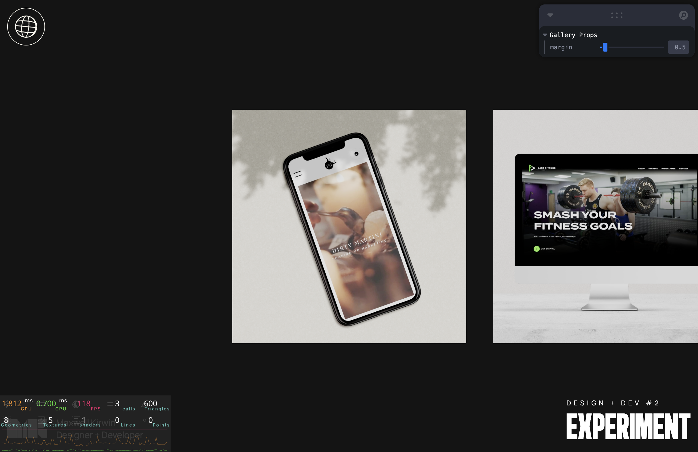

This is a [Next.js](https://nextjs.org/) project bootstrapped with [`create-next-app`](https://github.com/vercel/next.js/tree/canary/packages/create-next-app).

## MxK R3F #2

### Hover over planes moves to cursor, cursor out goes back to origin

